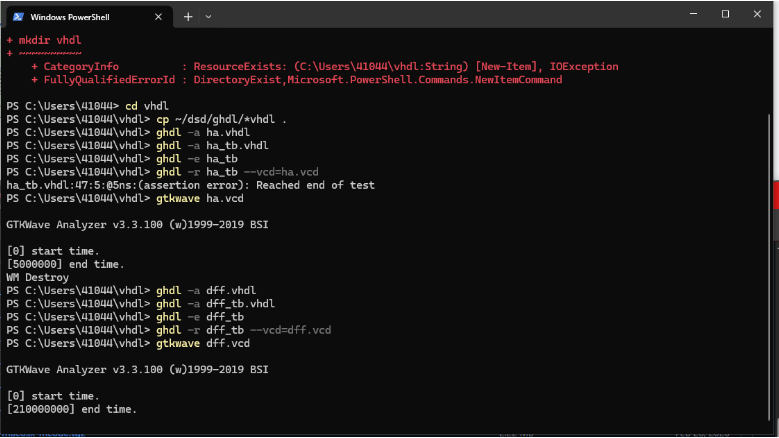
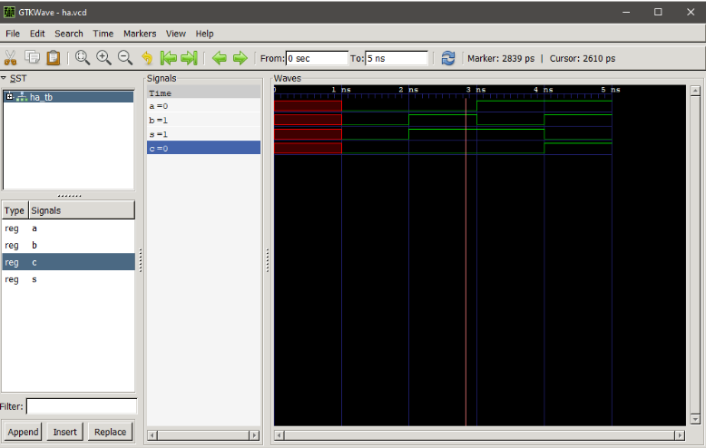
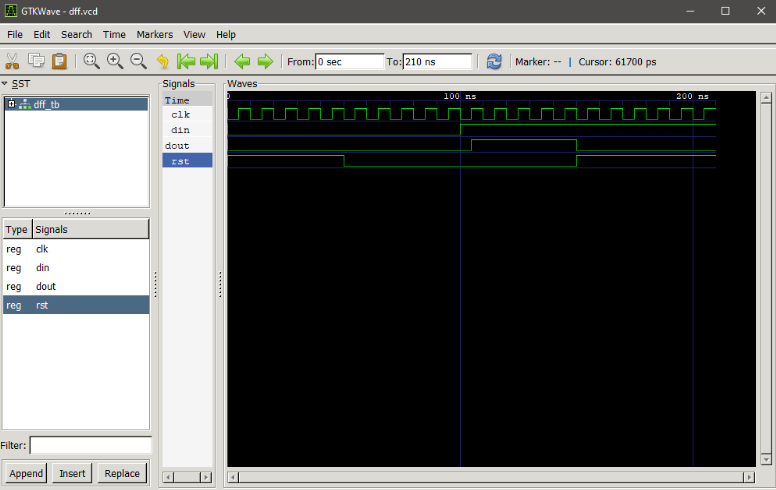

# Lab 1 — GHDL and GTKWave

## Overview
This lab focused on using GHDL and GTKWave for digital system design. The goal was to run simulations of basic logic circuits, such as a Half Adder, and document the results.

## Steps Taken
1. Cloned the repository and navigated to the `GHDL` folder.
2. Installed **GHDL** and **GTKWave**.
3. Ran the **Half Adder** example successfully.
 
4. Executed an additional simulation, **D Flip-Flop**
 
5. Final saved waveform images.
  
  
## Additional Findings
- Required `gtkwave` to be installed separately.
- Had to adjust **simulation commands** to match Windows settings.
- Some testbench files needed minor modifications to run properly.
- Used **Terminal** instead of Bash for commands.

---

