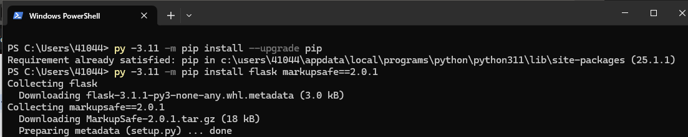
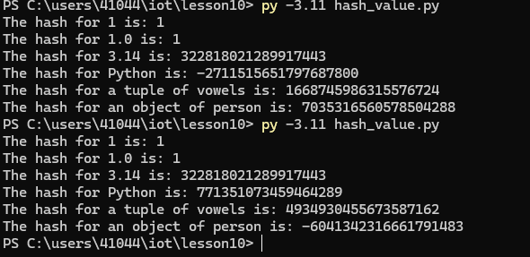
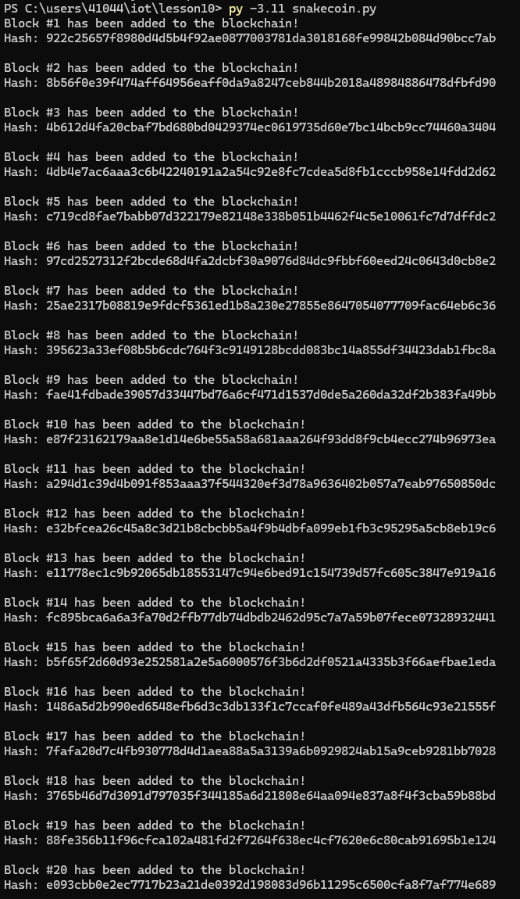
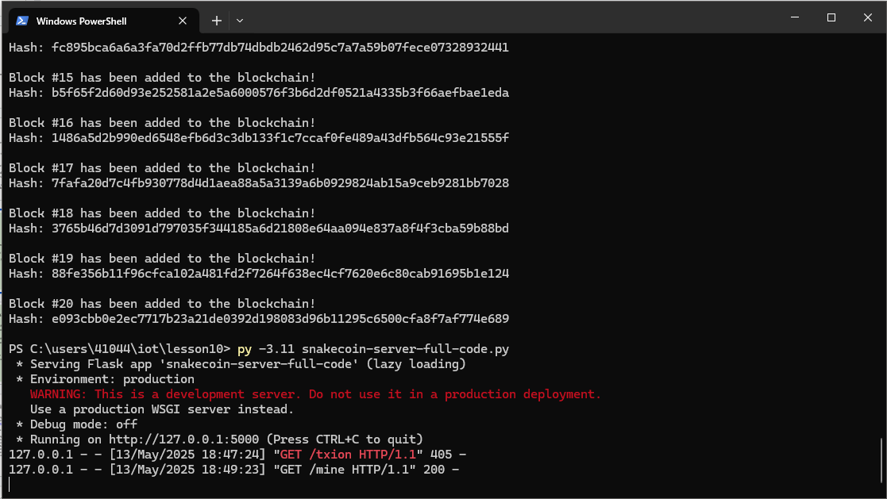
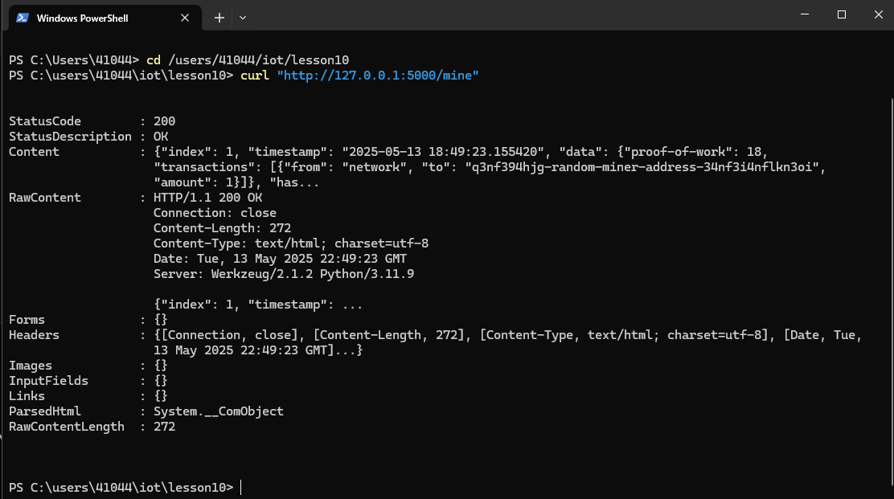
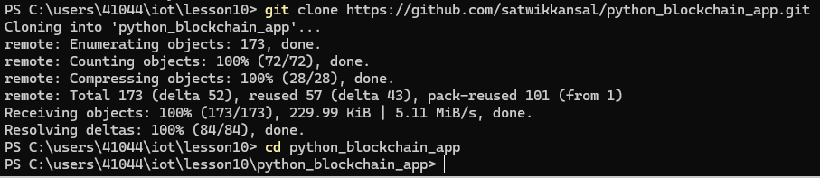
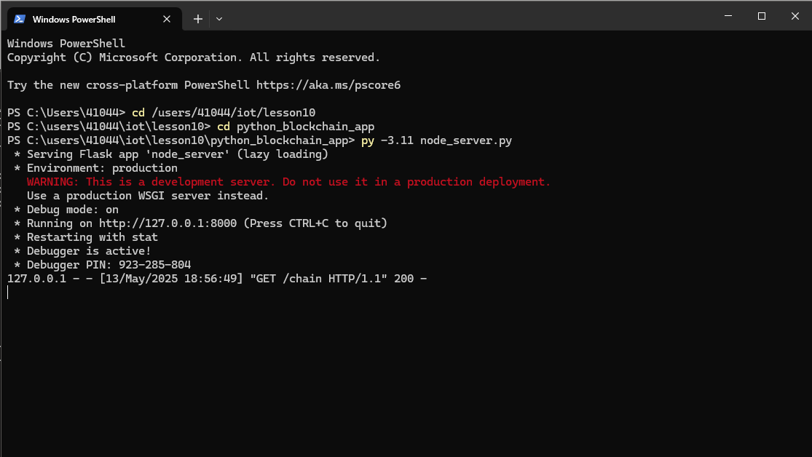
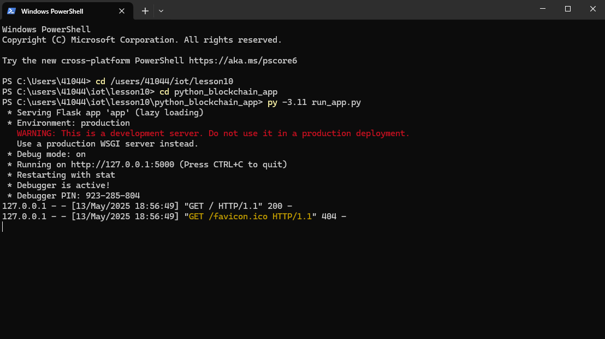

# Lab 10 — Blockchain

## Overview
This lab explores basic blockchain concepts by:

- Running a randomized SHA-256 hash generator twice  
- Building and running a minimal “SnakeCoin” blockchain  
- Serving and mining blocks via a Flask-based Python server  
- Cloning a simple Python blockchain web app and running its server & client  

---

# 1) Installed any missing Python packages:
```bash
py -3.11 -m pip install --upgrade pip
py -3.11 -m pip install flask markupsafe==2.0.1
```

# 2) Inspected & ran the generator twice
```bash
py -3.11 hash_value.py
py -3.11 hash_value.py
```


Note/Observation:
- Integers and floats always produce the same hash every time you run the script.
- Strings, tuples (of strings), and custom objects get different hashes on each run because Python adds a random “salt” at startup for security.

# 3) Viewed the minimal chain implementation and executed it
```bash
py 3.11 snakecoin.py
```


# 4) Set up two terminals and ran the following commands

Terminal 1: run the Flask server
```bash
py 3.11 snakecoin-server-full-code.py
```

Terminal 2: submit a transaction & mine
```
curl "http://127.0.0.1:5000/mine"
```


Final Web Result
.png)
# 5) Cloned the Satwik Kansal app, edited the `node_server.py`, and started the API server and Web client 
```bash
git clone https://github.com/satwikkansal/python_blockchain_app.git
cd python_blockchain_app
```

Terminal 1: start the API server
```bash
py -3.11 node_server.py
```

Terminal 2: start the web client
```bash
py 3.11 run_app.py
```


Final Web Result
.png)
## Additional Findings
- Random salt in hash_value.py guarantees different digests each run.
- The simplistic SnakeCoin PoW loop illustrates how block difficulty and nonces interact.
- Running client & server in separate terminals mimics real-world node mining & transaction flows.
- Used **PowerShell** instead of Bash for execution.
