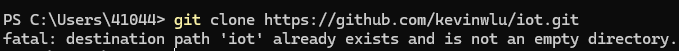
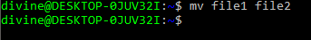

# Lab 2 — Command Line (PowerShell)

## Overview  
In this lab we explore basic file, directory, process, environment, Git, and networking commands using **Windows PowerShell** and **Ubuntu**.

---

## Prerequisites  
- **Windows 10** or later  
- **PowerShell** (v5+; built-in on Win10)  
- **Git for Windows** (ensure `git` is on your PATH)  

---

## Commands that Function within PowerShell

Command 1: `hostname`
 

Command 3: `ps`
 

Command 4: `pwd`
 
[fig1](4.png)

Command 5: `git clone https://github.com/kevinwlu/iot.git`
 

Command 6: `cd iot`
 

Command 7: `ls`
 

Command 8: `cd`
 

Command 9: `df`
 

Command 10: `mkdir demo`
 

Command 11: `cd demo`
 

Command 17: `clear`
 

Command 18: `man uname`
 
.png)
.png)

Command 19: `uname -a`
 

Command 20: `ifconfig`
 

Command 21: `ping localhost`
 

Command 22: `netstat`
 

---

## Commands that only function within a Linux context

Command 2: `env`
 

Command 12: `nano file`
 

Command 13: `cat file`
 

Command 14: `cp file file1`
 

Command 15: `mv file file2`
 

Command 16: `rm file2`
 

