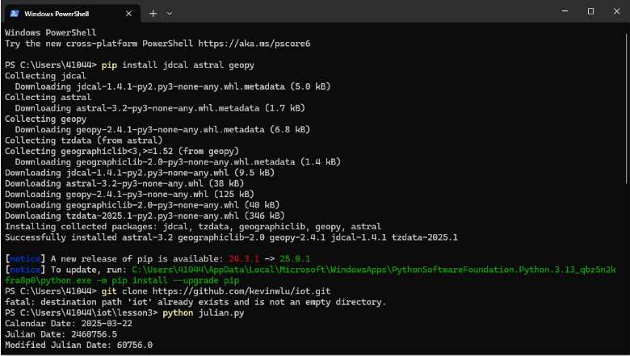
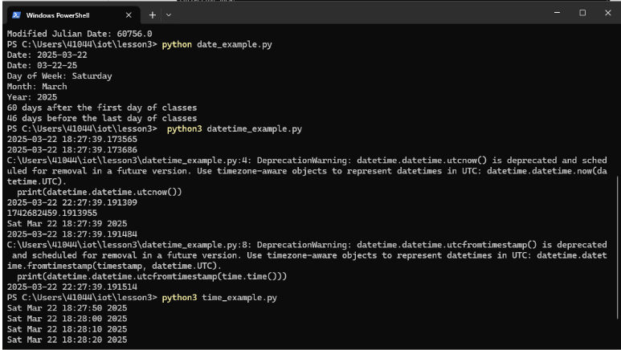
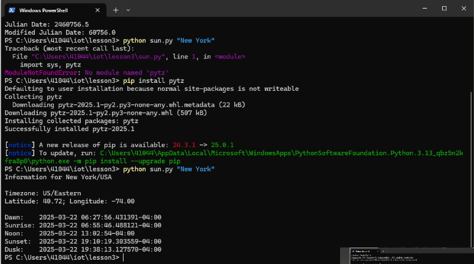
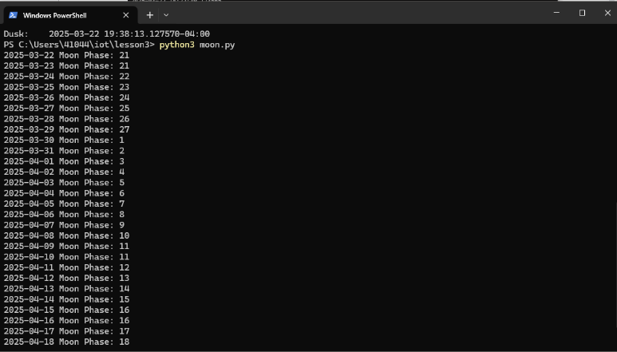
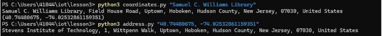
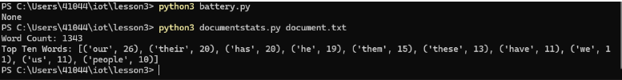

# Lab 3 — Python

## Overview
This lab involved running various Python scripts that utilized external libraries like **jdcal, astral, and geopy** for data processing.

## Steps Taken
1. Navigated to the `iot` repository and switched to the **Lesson 3** folder.
2. Installed required packages using:
   ```Terminal
   pip install jdcal astral geopy
   ```
3. Ran the following scripts:
   - **julian.py** → Converted dates to Julian format.
      
   - **date_example.py, datetime_example.py, time_example.py**
      
   - **sun.py "New York"** → Retrieved sunrise and sunset times.
      
   - **moon.py** → Retrieved moon data.
      
   - **coordinates.py "Samuel C. Williams Library"** → Got latitude & longitude & **address.py "40.74480675, -74.02532861159351"** → Got street address.
      
   - **cpu.py** → Got CPU info.
      
   - **battery.py** → Battery info* & *documentstats.py document.txt** → Processed text document statistics.
      

## Additional Findings
- Had to manually install `pytz` as it is needed for sun.py.
- Had to manually install `psutil` as it is needed for cpu.py.
- The `address.py` script required an internet connection for geolocation.
- time_example.py ran seemingly indefinately
- Used **Terminal** instead of Bash for execution.


---
