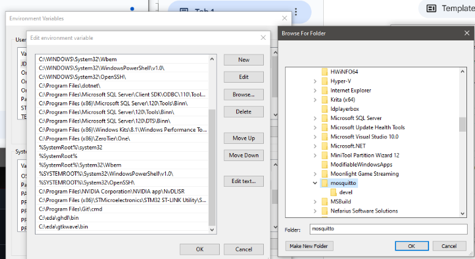
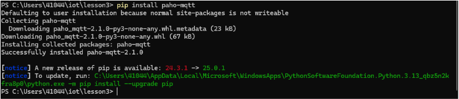
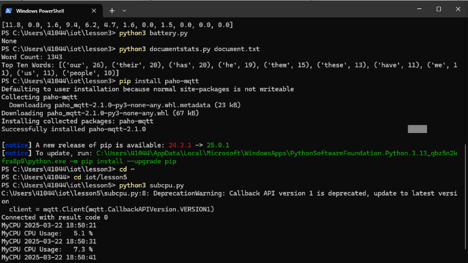
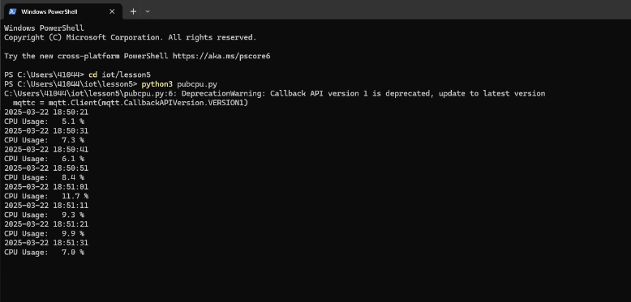

# Lab 5 — Paho-MQTT

## Overview
This lab focused on using **Paho-MQTT** for communication between a publisher and subscriber script.

## Steps Taken
1. Installed Mosquitto and added it to the the System Variables
   
3. Installed **Paho-MQTT** using:
   ```terminal
   pip install paho-mqtt
   ```
   
4. Navigated to the `iot` repository and updated it with:
   ```terminal
   git pull
   ```
5. Ran `subcpu.py` in one terminal to act as the **subscriber**.
   
6. Ran `pubcpu.py` in another terminal to act as the **publisher**.
   
7. Verified the data exchange using printed messages.

## Additional Findings
- Allowed Python through Windows Firewall for MQTT messages.
- Used **Mosquitto MQTT Broker** for testing.
- Used **Terminal** instead of a Unix terminal.

---
