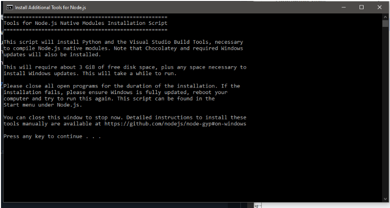
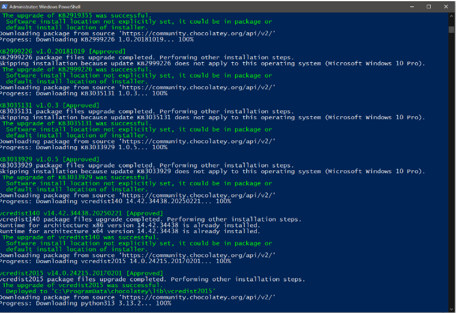
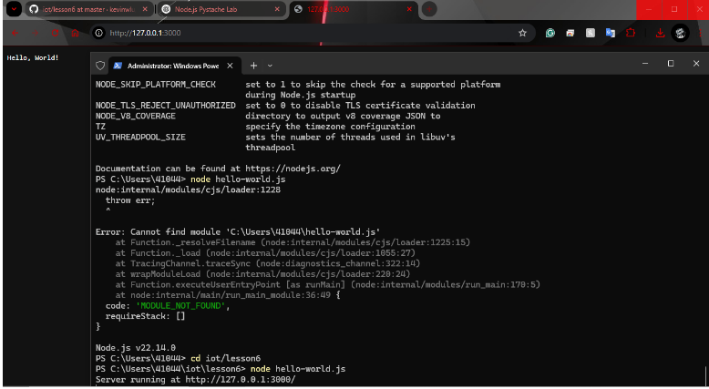
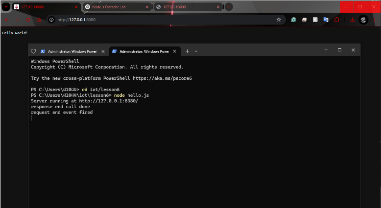
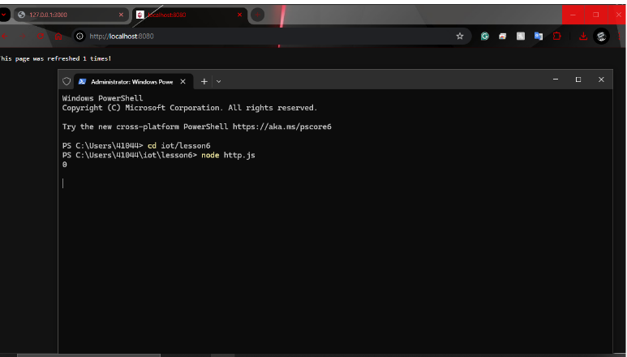
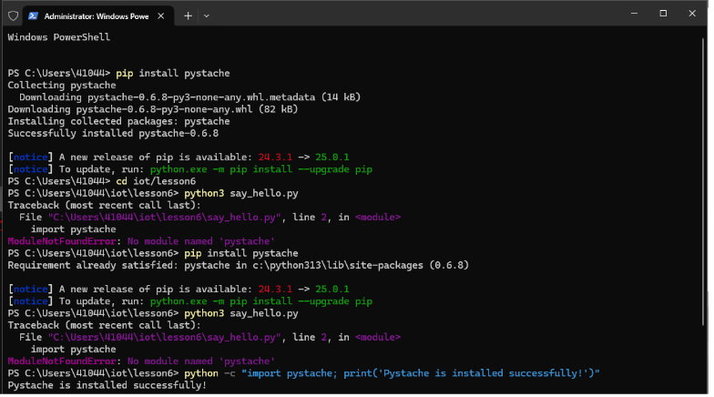
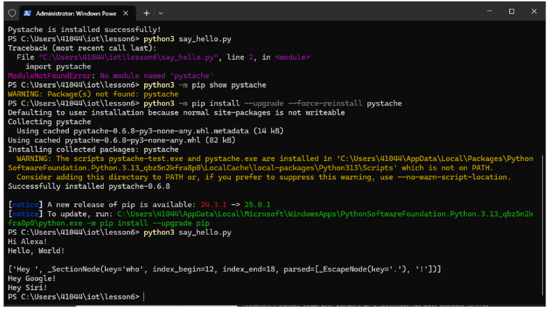

# Lab 6 — Node.js and Pystache

## Overview
This lab introduced **Node.js** and **Pystache** for templating and server-side scripting.

## Steps Taken
1. Installed **Node.js** and verified installation with:
   
   
   
   ```powershell
   node -v
   ``` 
3. Ran **hello-world.js, hello.js, and http.js**, refreshing the webpage to observe server activities.
   
   
   
5. Troubleshooted and Installed **Pystache** using:
    ```Terminal
   python3 -m pip install --upgrade --force-reinstall pystache
   ```
    

   Then, `say_hello.py` was executed to render the template in `say_hello.mustache`.
   

## Additional Findings
- Needed to run Node.js scripts using **Terminal**.
- Had to manually start the Node.js server before testing.
- Had issues getting `pystache` installed to the correct python instance
- Used `Ctrl+C` to stop the server process when needed.
