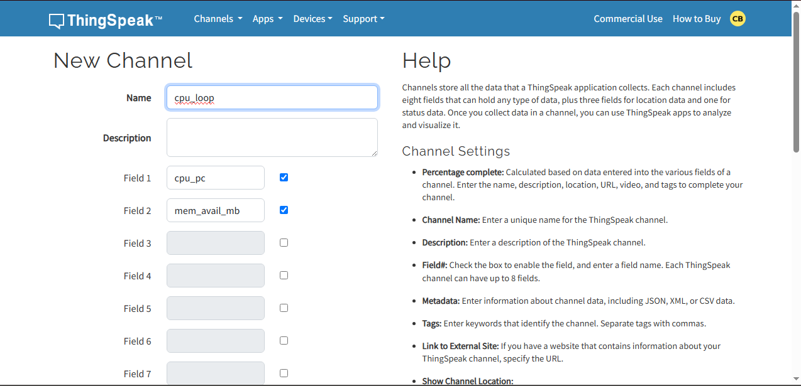
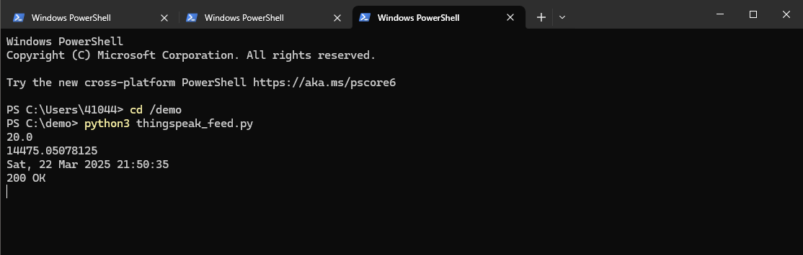
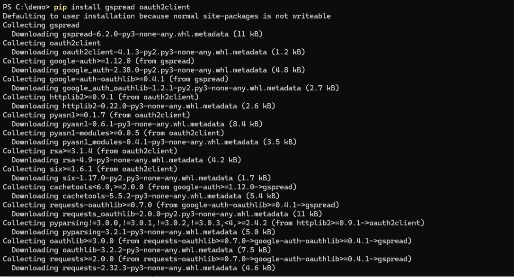
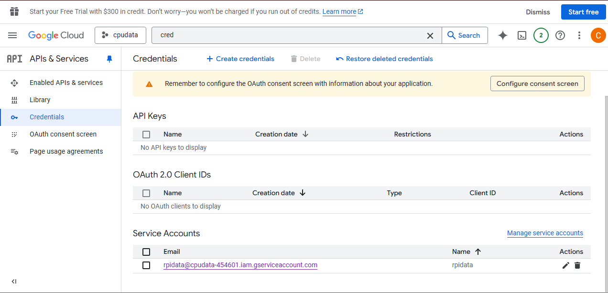
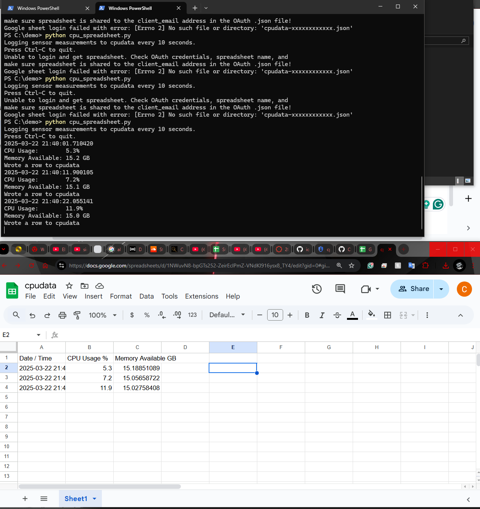

# Lab 7 — ThingSpeak and Google Sheets

## Overview
This lab involved using **ThingSpeak** for data logging and integrating it with **Google Sheets** using Python.

## Steps Taken
1. Logged into my existing **MathWorks ThingSpeak** account, and setup the required channels.
    
3. Ran `thingspeak_cpu_loop.py` and `thingspeak_feed.py` in a demo folder to send data.
    
5. Installed required Python modules:
   ```Terminal
   pip install gspread oauth2client
   ```
    
6. Logged into **Google Cloud Platform**, created a project named `cpudata`, and enabled **Drive API** and **Sheets API**.
7. Generated and downloaded the **OAuth JSON key file**.
   
8. Created a new **Google Sheet** named `cpudata`, shared it with the client email from the JSON file, and removed extra rows.
9. Ran `cpu_spreadsheet.py` using the JSON key file:
   ```Terminal 
   python cpu_spreadsheet.py
   ```
    

## Additional Findings
- Ensured the **OAuth JSON file** was in the correct directory.
- Had to manually share the Google Sheet with the service account email.
- Debugging required checking API permissions and verifying the JSON file path.
- Used **PowerShell** instead of Bash for execution.
