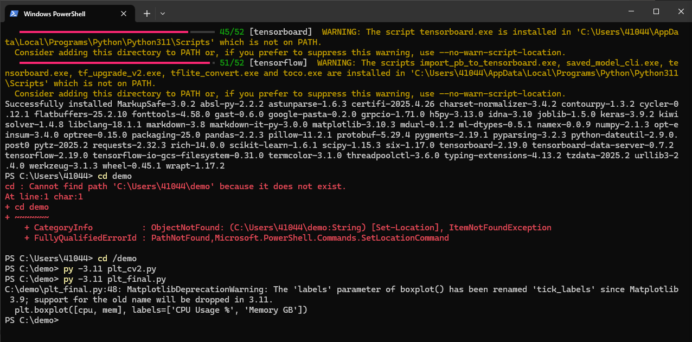
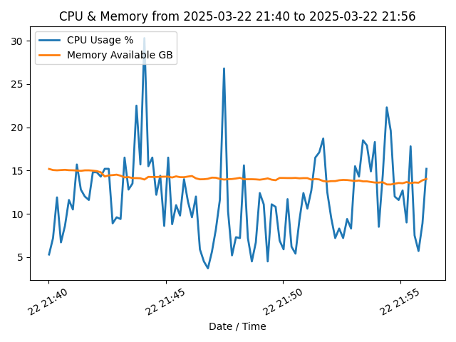
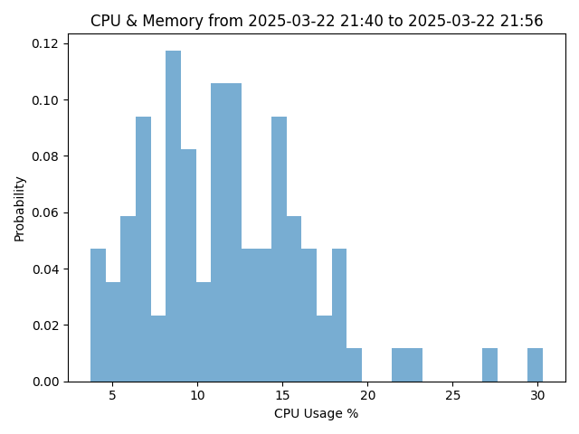
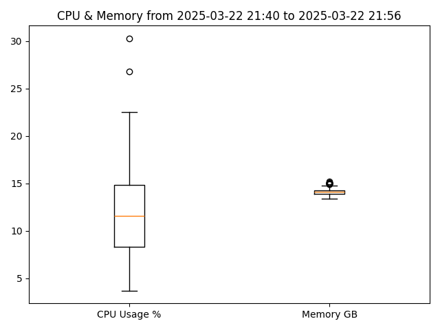
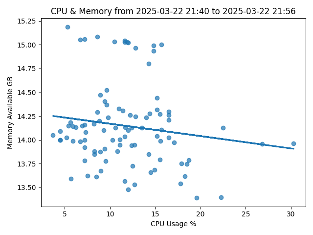
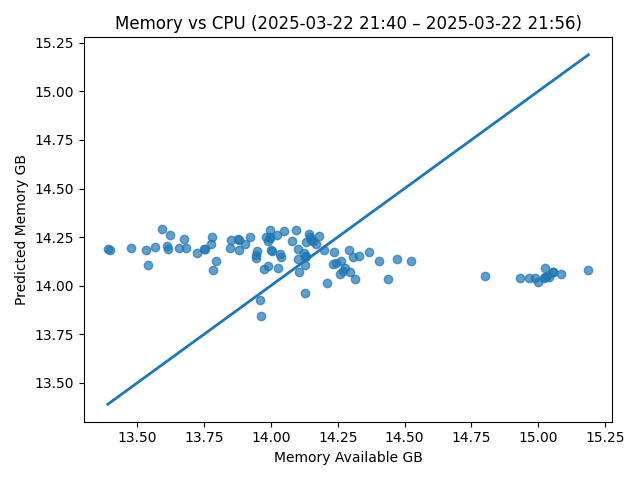

# Lab 8 — CPU & Memory Data Visualization with Python

## Overview
This lab involved reading CPU and memory usage data from a CSV file (`cpudata1.csv`) using **pandas**, then visualizing it with **matplotlib** and evaluating a simple linear model with **scikit-learn**.

## Steps Taken
1. Installed Python 3.11 as Tensorflow was incompatible with the existing newer installation 
   ```bash
   winget install --id Python.Python.3.11 -e --source winget
2. Installed required Python modules  
   ```bash
   py -3.11 -m pip install pandas matplotlib scipy scikit-learn
3. Ran `plt_cv2.py` and `plt_final.py` in a demo folder.
    
    
7. Generated and saved the graphs.
   
   
   
   
   
   
## Additional Findings
- Missing dependencies: Initially got ModuleNotFoundError for pandas, matplotlib or scikit-learn; resolved by installing the correct packages via pip install.
- Used **PowerShell** instead of Bash for execution.
