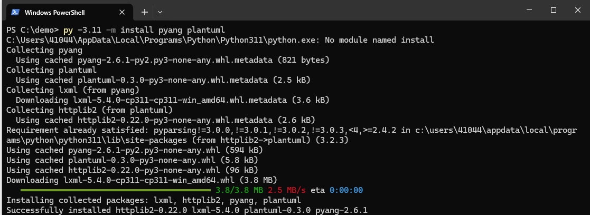
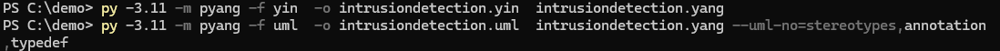
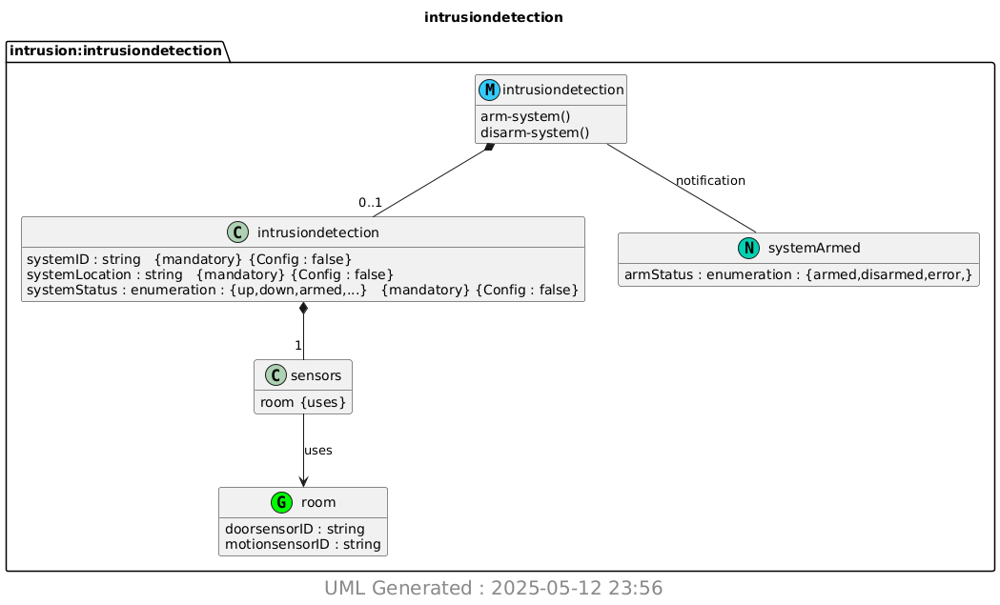

# Lab 9 — YANG

## Overview
This lab uses **YANG** (Yet Another Next Generation) to model an intrusion-detection module, then converts that model into **YIN** (an XML syntax) and a **UML** diagram using **pyang** and **PlantUML**.

## Prerequisites 
- **Python 3** and **pip3**  
- **Java JDK** (for PlantUML)  

1. Installed required Python modules  
   ```bash
   py -3.11 -m install pyang plantuml
   ```
   
2. Ran `Pyang` to generate intrusiondetection.yin and intrusiondetection.uml  
   ```bash
   py -3.11 pyang -f yin -o intrusiondetection.yin intrusiondetection.yang
   py -3.11 pyang -f uml -o intrusiondetection.uml intrusiondetection.yang --uml- no=stereotypes,annotation,typedef
   ```
   
3. Ran `PlantUML` to generate the png.
     ```bash
   py -3.11 -m plantuml intrusiondetection.uml
   ```
   
  

